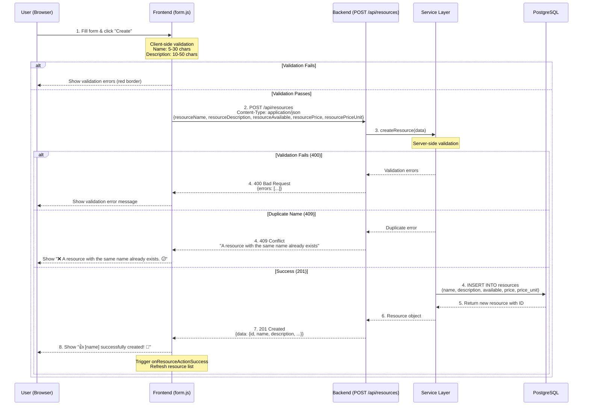
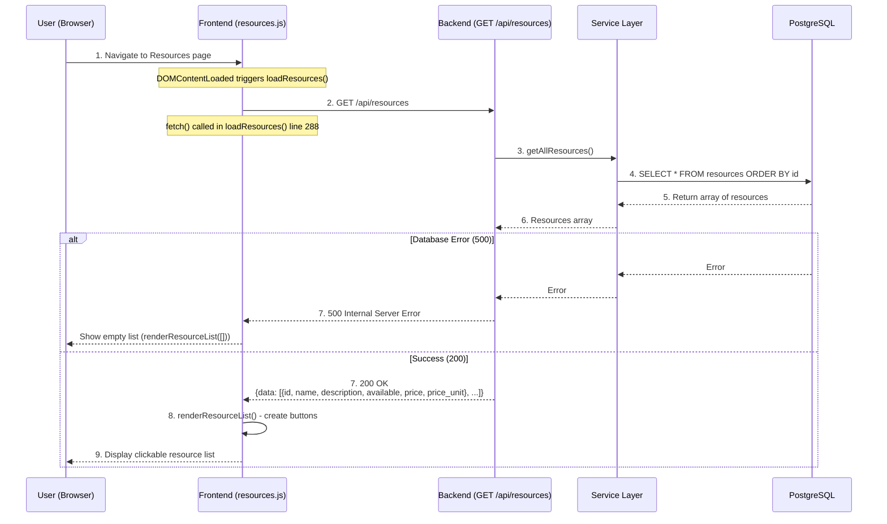
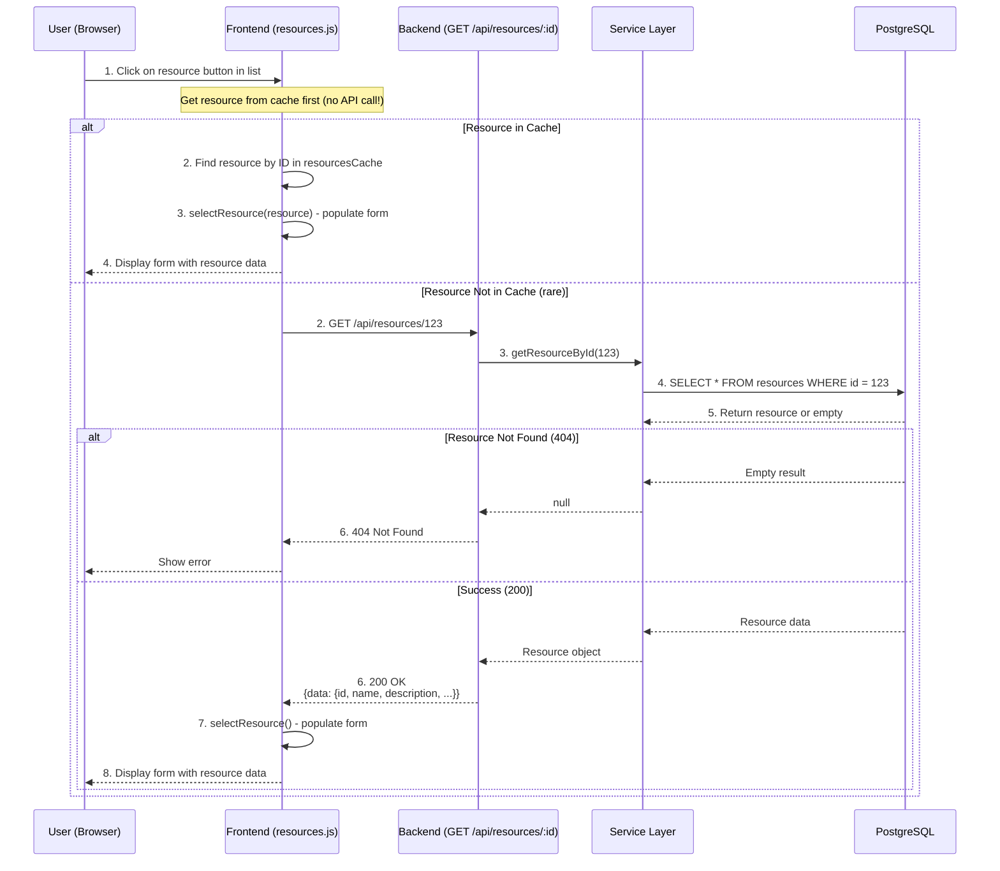
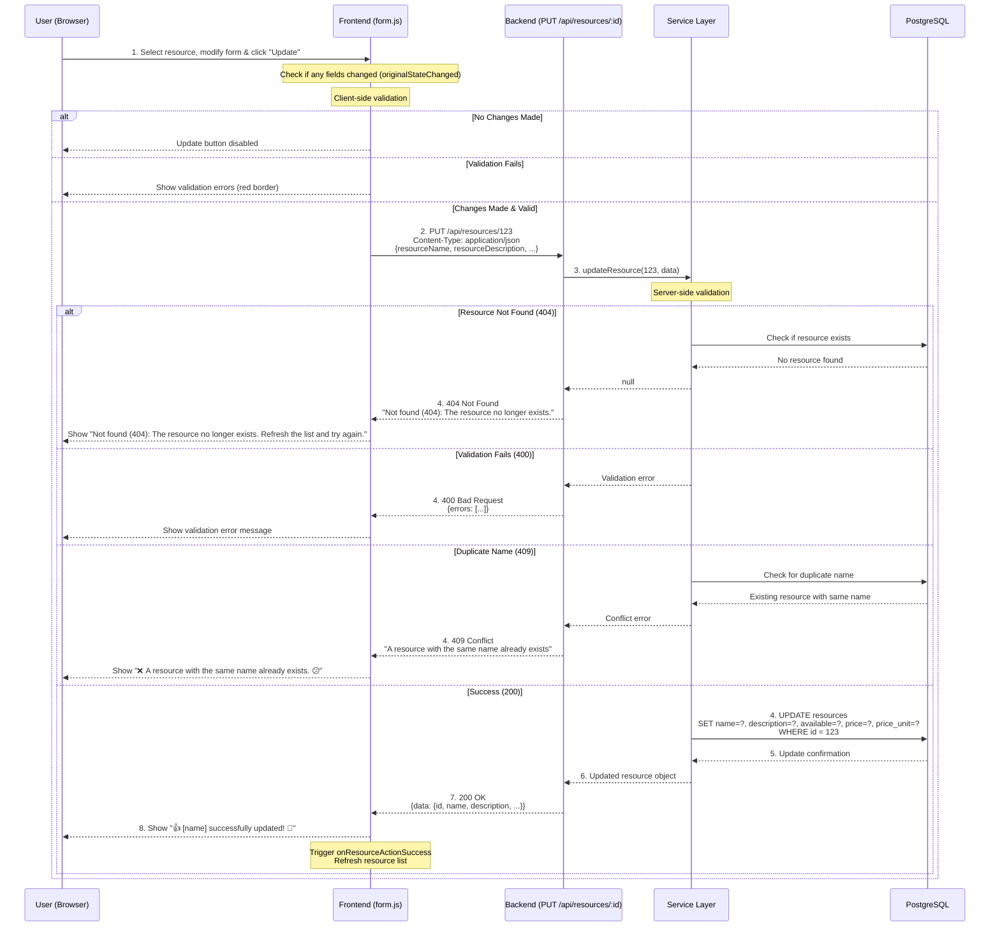
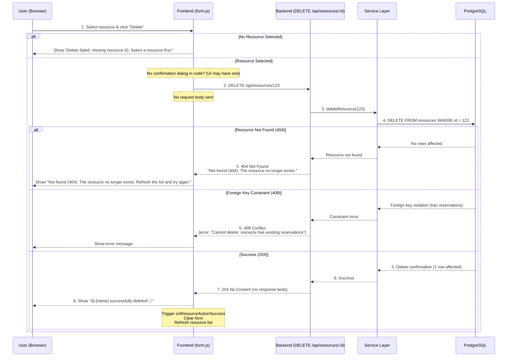

# G1: CRUD Data Flow Analysis - Booking System Phase 6

## 📁 Repository Structure
```
BookingSystem/
└── Phase6/
    └── G1_CRUD_DataFlow.md
```

## 🔍 Verification Methodology
- **Browser Developer Tools**: Network tab to capture actual HTTP requests/responses
- **Code Analysis**: Examined `form.js` and `resources.js` for endpoint patterns
- **Database**: PostgreSQL via Adminer at http://localhost:8080

## 1️⃣ CREATE Operation



## 2️⃣ READ Operation

### A. Read All Resources (List View)



### B. Read Single Resource (Select for Edit)



## 3️⃣ UPDATE Operation



## 4️⃣ DELETE Operation



## 📊 Summary Table

| Operation | Method | URL Pattern | Success Status | Error Statuses |
|-----------|--------|-------------|----------------|----------------|
| Create | POST | `/api/resources` | 201 Created | 400, 409, 500 |
| Read (all) | GET | `/api/resources` | 200 OK | 500 |
| Read (one) | GET | `/api/resources/:id` | 200 OK | 404, 500 |
| Update | PUT | `/api/resources/:id` | 200 OK | 400, 404, 409, 500 |
| Delete | DELETE | `/api/resources/:id` | 204 No Content | 404, 409, 500 |

## 🔐 Validation Rules (from code)

| Field | Rules |
|-------|-------|
| resourceName | 5-30 chars, allowed: a-z A-Z 0-9 äöå ÄÖÅ space , . - |
| resourceDescription | 10-50 chars, allowed: a-z A-Z 0-9 äöå ÄÖÅ space , . - |
